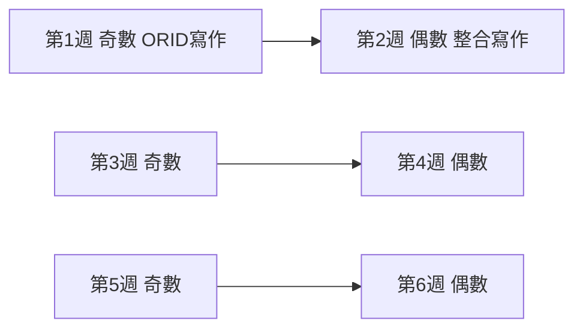
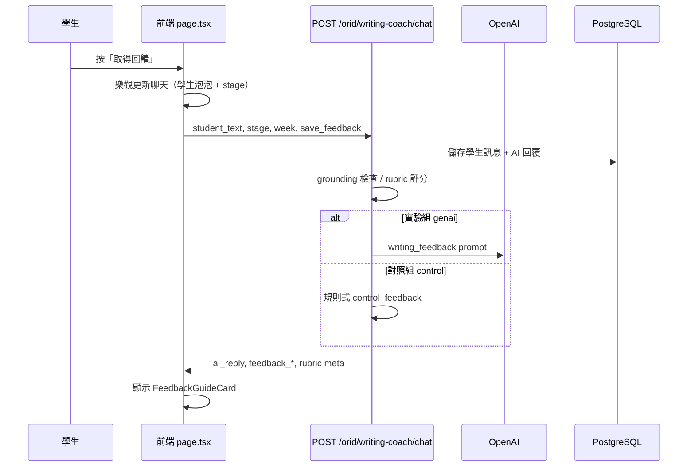
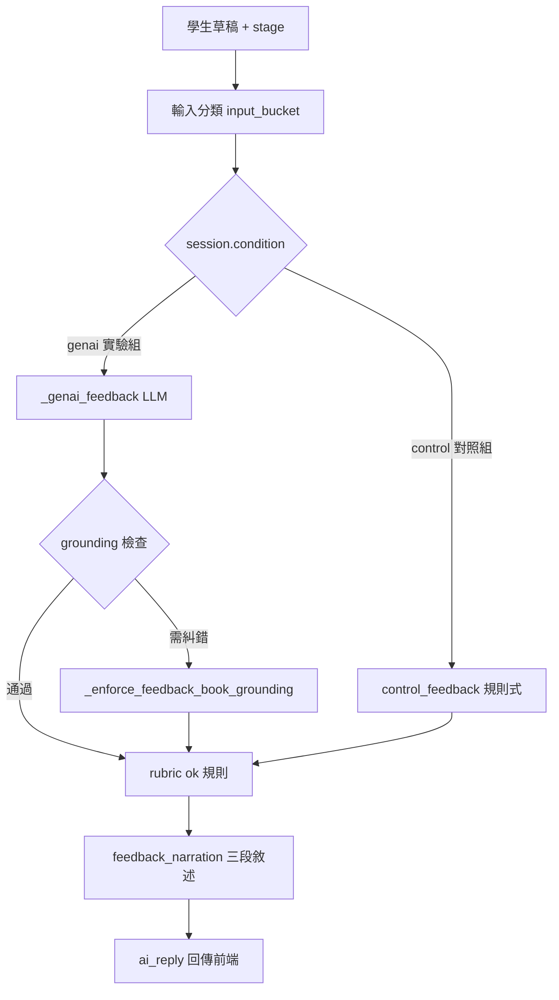

# ORID 反思寫作系統（orid_system）

國小高年級閱讀反思寫作平台。學生讀完書後，依 **ORID 四段框架**（觀察 → 感受 → 體悟 → 行動）分段寫作，並由 AI 寫作小幫手提供回饋；教師可透過儀表板檢視班級進度；管理員可管理帳號與班級。

本專案以 [Next.js + FastAPI 模板](https://github.com/vintasoftware/nextjs-fastapi-template) 為起點開發，但核心功能、資料模型與 prompt 架構皆已改為 ORID 專用設計。

---

## 目錄

- [這個系統在做什麼](#這個系統在做什麼)
- [使用者與角色](#使用者與角色)
- [功能總覽](#功能總覽)
- [教學流程與週次設計](#教學流程與週次設計)
- [系統架構](#系統架構)
- [技術棧](#技術棧)
- [專案目錄結構](#專案目錄結構)
- [本機開發環境](#本機開發環境)
- [正式環境部署](#正式環境部署)
- [環境變數說明](#環境變數說明)
- [資料模型](#資料模型)
- [書籍內容（book_pack）](#書籍內容book_pack)
- [AI 回饋與 Prompt 架構](#ai-回饋與-prompt-架構)
- [實驗組與對照組](#實驗組與對照組)
- [測試](#測試)
- [延伸文件與交接建議](#延伸文件與交接建議)

---

## 這個系統在做什麼

### 給使用者（學生、教師）

學生登入後，每週閱讀指定書籍，在左側四格依 **O / R / I / D** 寫反思；寫好一段後按「取得回饋」，右側聊天區會出現：

1. **你的寫作**（學生泡泡）
2. **AI 回饋卡片**（你已經做到 / 你可以再加強 / 試試看這樣寫）

偶數週（第 2、4、6 週）則進入**整合寫作**：把上週四段收成一篇短文，再取得整合回饋。

教師可查看各班學生的寫作進度、對話紀錄與後測分數；管理員負責帳號、班級與實驗分組設定。

### 給工程師

系統由 **Next.js 前端 + FastAPI 後端 + PostgreSQL** 組成。前端透過 BFF（`app/api/*`）代理後端 API；後端負責 session、寫作儲存、LLM 回饋、grounding 檢查與 rubric 計分。書籍內容以 JSON `book_pack` 注入 prompt 與 RAG。

```mermaid
flowchart TB
  subgraph users [使用者]
    Student[學生]
    Teacher[教師]
    Admin[管理員]
  end

  subgraph frontend [Next.js 前端]
    Pages[頁面 /dashboard /teacher /admin]
    BFF[API 代理 app/api/*]
    Components[components/orid/*]
  end

  subgraph backend [FastAPI 後端]
    OridRoutes[/orid/*]
    TeacherRoutes[/teacher/*]
    AdminRoutes[/admin/*]
    Prompts[prompts/ 模組化 prompt]
    Services[services/ 評分 徽章 RAG]
  end

  subgraph data [資料與內容]
    PG[(PostgreSQL)]
    BookPack[book_pack JSON]
    Embeddings[FAISS 向量索引]
    OpenAI[OpenAI API]
  end

  Student --> Pages
  Teacher --> Pages
  Admin --> Pages
  Pages --> BFF
  BFF --> OridRoutes
  BFF --> TeacherRoutes
  BFF --> AdminRoutes
  OridRoutes --> Prompts
  OridRoutes --> Services
  OridRoutes --> PG
  OridRoutes --> BookPack
  Services --> Embeddings
  Prompts --> OpenAI
```

---

## 使用者與角色

| 角色 | 登入後入口 | 主要能力 |
|------|-----------|----------|
| **學生** `student` | `/dashboard` | 週次寫作、取得回饋、徽章、整合寫作 |
| **教師** `teacher` | `/teacher` | 班級總覽、學生進度、對話紀錄、後測評分、CSV 匯出 |
| **管理員** `admin` | `/admin` | 使用者 CRUD、班級 CRUD、實驗組/對照組指派 |

角色定義於 `fastapi_backend/app/models.py`（`User.role`），後端路由以 `require_admin` 等依賴保護。

學生另有 **`orid_condition`** 欄位（`experimental` / `control`），決定回饋是否走 LLM 路徑（見[實驗組與對照組](#實驗組與對照組)）。

---

## 功能總覽

### 學生端

| 功能 | 說明 | 主要檔案 |
|------|------|----------|
| **ORID 四段寫作** | O 觀察 / R 感受 / I 體悟 / D 行動，每段可存草稿 | `nextjs-frontend/app/dashboard/books/week/[week]/page.tsx` |
| **取得回饋** | 針對目前段落給結構化回饋（praise / missing / suggestions） | `POST /orid/writing-coach/chat`（`source: feedback_button`） |
| **寫作小幫手聊天** | 右側回饋區顯示學生寫作 + AI 回饋卡片 | `FeedbackGuideCard.tsx`, `parse-feedback-narration.ts` |
| **整合寫作** | 偶數週把上週四段合成一篇 | `SynthesisWritingGuide.tsx`, `synthesis-opening.ts` |
| **徽章** | 依 rubric 總分（90 分制）解鎖 30 / 60 / 90 徽章 | `badgeRules.ts`, `orid_badges.py` |
| **進度與分數** | 四段完成度、總分顯示 | `rubricScoring.ts`, `orid_rubric_scoring.py` |

### 教師端

| 功能 | API | 前端 |
|------|-----|------|
| 班級總覽 | `GET /teacher/classes/{id}/overview` | `app/teacher/page.tsx` |
| 學生週次摘要 | `GET /teacher/.../students/{id}/summary` | 學生詳情頁 |
| 對話紀錄 | `GET /teacher/.../chat-messages` | 教師檢視寫作教練對話 |
| 後測評分 | `GET/PUT .../post-test` | 手動輸入後測 rubric |
| 資料匯出 | `GET /teacher/classes/{id}/export` | CSV |

### 管理員端

- 使用者管理（角色、班級、`orid_condition`）：`app/admin/users/page.tsx`
- 班級管理：`app/admin/classes/page.tsx`

---

## 教學流程與週次設計

### ORID 四段

| 階段 | 英文 | 學生要寫什麼 |
|------|------|-------------|
| **O** | Objective | 故事裡誰做了什麼、事件順序（客觀事實） |
| **R** | Reflective | 我的感受 + 因為書裡哪一幕 |
| **I** | Interpretive | 我學到/明白什麼 + 理由 |
| **D** | Decisional | 以後在現實生活中會怎麼做（具體行動） |

每段有 **d1**（主要草稿）與 **d2**（可選第二稿）；回饋按鈕針對 **d1** 取得回饋。

### 六週架構（奇數寫作 / 偶數整合）



| 週次 | 類型 | 學生在做什麼 |
|------|------|-------------|
| 1, 3, 5 | 奇數週 | 閱讀本書元 ORID 四段寫作 |
| 2, 4, 6 | 偶數週 | 唯讀顯示上週四段 + 中間寫整合稿 + 整合回饋 |

週次邏輯集中於 `nextjs-frontend/lib/orid/week-flow.ts`：

- `isOddWeek(w)` / `isEvenWeek(w)`
- `priorOddWeek(w)` — 偶數週對應的上週奇數週
- `bookUnitFromWeek(w)` — 書籍單元（1–2 週 → 單元 1，3–4 → 單元 2…）

**目前開放範圍**：`ORID_UNLOCKED_WEEKS = 2`（僅第 1–2 週可進入），定義於 `lib/orid-week-access.ts`。擴充至第 6 週時需新增對應 `book_pack_weekN.json` 並調高此常數。

### 學生一次「取得回饋」的流程



---

## 系統架構

### 前端（Next.js 16）

- **頁面路由**：`nextjs-frontend/app/`
  - 學生：`dashboard/`, `dashboard/books/week/[week]/`
  - 教師：`teacher/`, `teacher/classes/[classId]/`
  - 管理員：`admin/users`, `admin/classes`
- **BFF 代理**：`app/api/orid/*`, `app/api/teacher/*`, `app/api/admin/*`  
  將 JWT 從 cookie 轉成 Bearer 呼叫後端（`lib/orid-bff-auth.ts`）。
- **ORID 共用邏輯**：`lib/orid/`（週次、開場、徽章、評分）
- **UI 元件**：`components/orid/`（寫作面板、回饋卡片、徽章、整合寫作引導等）
- **OpenAPI 型別**：`app/openapi-client/`（由 `local-shared-data/openapi.json` 產生）

### 後端（FastAPI）

路由掛載於 `fastapi_backend/app/main.py`：

| 前綴 | 模組 | 職責 |
|------|------|------|
| `/auth`, `/users` | fastapi-users | 登入、JWT |
| `/orid` | `routes/orid.py` | 學生 session、寫作、回饋、聊天、進度 |
| `/teacher` | `routes/teacher.py` | 教師儀表板 API |
| `/admin` | `routes/admin.py` | 管理 API |

服務層 `app/services/`：

| 檔案 | 職責 |
|------|------|
| `orid_rubric_scoring.py` | ORID + SEL rubric，滿分 90 |
| `orid_badges.py` | 徽章計算與事件 |
| `orid_condition.py` | experimental / control 正規化 |
| `orid_writing_store.py` | `orid_writing_v1` JSON 讀寫 |
| `rag.py` / `rag_faiss.py` | 書摘向量檢索 |
| `safety.py` | 不當內容檢查 |

### Prompt 模組（後端）

```
fastapi_backend/app/prompts/
├── versions.py              # 各 prompt 版本號（wf_v10, wc_v6…）
├── orid_playbook.py         # 回饋敘述、教練語氣規則
├── builders/                # 組裝 system/user prompt
│   ├── coach_chat.py
│   ├── writing_feedback.py
│   └── checker.py
├── templates/               # 長文字模板（階段規則、BOOK_FACT_RULES）
├── policy/                  # 業務規則（grounding、control_feedback、scaffold_guard）
├── parsers/                 # LLM JSON 解析
└── shared_parts/            # book_context、stage_text
```

修改回饋行為時，通常依序檢查：`templates/writing_feedback.py` → `builders/writing_feedback.py` → `routes/orid.py` 的 `_genai_feedback` / `_enforce_feedback_book_grounding`。

---

## 技術棧

| 層級 | 技術 |
|------|------|
| 前端 | Next.js 16, React 19, TypeScript, Tailwind, shadcn/ui |
| 後端 | FastAPI, SQLAlchemy 2 (async), Alembic, fastapi-users |
| 資料庫 | PostgreSQL 17 |
| AI | OpenAI API（chat + embedding）；可選 FAISS 向量檢索 |
| 套件管理 | pnpm（前端）, uv（後端） |
| 容器 | Docker Compose（開發與正式環境） |
| 測試 | pytest（後端）, Jest（前端，目前以 auth 頁為主） |

---

## 專案目錄結構

```
orid_system/
├── fastapi_backend/           # Python API
│   ├── app/
│   │   ├── routes/            # orid.py, teacher.py, admin.py
│   │   ├── services/          # 評分、徽章、RAG、條件分組
│   │   ├── prompts/           # 模組化 prompt（見上）
│   │   ├── content/           # rubrics.py 等靜態內容
│   │   └── models.py          # SQLAlchemy 模型
│   ├── alembic_migrations/    # DB schema 版本
│   ├── tests/                 # pytest
│   ├── docs/                  # RASF、整合寫作規格
│   ├── start.sh               # 本機開發啟動
│   └── start.prod.sh          # 正式環境啟動
│
├── nextjs-frontend/           # Next.js 應用
│   ├── app/                   # 頁面 + API BFF
│   ├── components/orid/       # ORID UI 元件
│   ├── lib/orid/              # 週次、開場、徽章、評分
│   └── __tests__/             # Jest
│
├── local-shared-data/         # 跨容器共用資料
│   ├── book_pack_week1.json   # 第 1 週書籍包
│   ├── openapi.json           # OpenAPI schema（前端型別）
│   └── embeddings/            # FAISS 向量索引（可選）
│
├── docs/                      # MkDocs + ORID_CHATBOT_DESIGN.md
├── runtime/backups/postgres/  # 正式環境 DB 備份
├── docker-compose.yml         # 本機開發
├── docker-compose.prod.yml    # 正式環境
├── update-prod.bat            # Windows 正式部署腳本
├── backup-db.bat / restore-db.bat
└── Makefile                   # 常用指令捷徑
```

---

## 本機開發環境

### 需求

- Docker Desktop（建議）
- 或：Python 3.12 + uv、Node.js + pnpm、PostgreSQL

### 方式 A：Docker Compose（建議）

在專案根目錄：

```bash
make docker-build
docker compose up -d db db_test
make docker-migrate-db
docker compose up backend frontend
```

| 服務 | 本機網址 |
|------|----------|
| 前端 | http://127.0.0.1:3100 |
| 後端 API | http://127.0.0.1:18000 |
| API 文件 | http://127.0.0.1:18000/docs |
| MailHog（測試信） | http://127.0.0.1:8025 |
| Postgres | localhost:15432 |

環境檔：根目錄 `.env`（後端 compose 讀取）；前端在容器內使用 `API_BASE_URL=http://backend:8000`。

### 方式 B：本機直接跑

```bash
# 1. 只起資料庫
docker compose up -d db
make docker-migrate-db

# 2. 後端
cd fastapi_backend
cp .env.example .env    # 填入 OPENAI_API_KEY 等
cd .. && make start-backend

# 3. 前端
cd nextjs-frontend
cp .env.example .env.local
cd .. && make start-frontend
```

此時預設為 **localhost:8000**（後端）與 **localhost:3000**（前端），與 Docker 埠號不同。

### 常用 Makefile 指令

```bash
make help                  # 列出所有指令
make test-backend          # pytest
make test-frontend         # Jest
make docker-test-backend   # 容器內 pytest
```

---

## 正式環境部署

正式環境使用 **`docker-compose.prod.yml`**，專案名稱 **`orid-prod`**。程式碼打包進 image（非 bind mount），僅 `local-shared-data` 唯讀掛載至後端。

### Windows 一鍵更新（建議）

```bat
update-prod.bat
```

腳本會依序：驗證 `.env.prod` → 備份資料庫 → `git pull` → build backend/frontend → migrate → 啟動服務。

選項：

- `--skip-backup` — 略過備份
- `--skip-pull` — 略過 git pull（僅重建目前工作目錄程式碼）

### 預設對外埠（可於 `.env.prod` 覆寫）

| 服務 | 環境變數 | 預設 host 埠 |
|------|----------|-------------|
| 前端 | `PROD_FRONTEND_PORT` | 3201 |
| 後端 | `PROD_BACKEND_PORT` | 18082 |
| 資料庫 | `PROD_DB_PORT` | 15434 |

### 手動步驟

```bash
docker compose -p orid-prod -f docker-compose.prod.yml --env-file .env.prod build backend frontend
docker compose -p orid-prod -f docker-compose.prod.yml --env-file .env.prod up -d db
# 等待 db healthy
docker compose -p orid-prod -f docker-compose.prod.yml --env-file .env.prod run --rm backend alembic upgrade head
docker compose -p orid-prod -f docker-compose.prod.yml --env-file .env.prod up -d backend frontend
```

### 資料庫備份與還原

- 備份：`backup-db.bat` → `runtime/backups/postgres/`
- 還原：`restore-db.bat`

詳細 VPS / 託管 Postgres 說明見 `docs/deployment.md`。

### 部署注意事項

1. **前端變更需 rebuild image**：正式環境沒有 bind mount 原始碼，`docker restart` 不會套用新程式；需 `build` 後 `up -d frontend`。
2. **後端**若只改 Python 且 volume 未掛載程式碼，同樣需 rebuild。
3. 首次部署前複製 `.env.prod.example` → `.env.prod` 並填入密鑰。

---

## 環境變數說明

### 後端（`fastapi_backend/.env.example`）

| 變數 | 用途 |
|------|------|
| `DATABASE_URL` | PostgreSQL 連線（asyncpg） |
| `ACCESS_SECRET_KEY` 等 | JWT / 重設密碼 |
| `OPENAI_API_KEY`, `OPENAI_MODEL` | LLM 回饋與 embedding |
| `ORID_RAG_IN_FEEDBACK` | 是否在回饋中啟用向量檢索 |
| `ORID_RAG_BACKEND` | `auto` / `faiss` / `memory` |
| `ORID_EMBEDDINGS_DIR` | FAISS 索引目錄（預設 `/app/shared-data/embeddings`） |
| `ORID_DEFAULT_CONDITION` | 新 session 預設條件（`genai`） |
| `ORID_FORCE_NEW_ALLOWLIST` | 允許強制開新 session 的帳號清單 |
| `ENABLE_PUBLIC_REGISTRATION_AND_PASSWORD_RESET` | 是否開放公開註冊 |

### 前端（`nextjs-frontend/.env.example`）

| 變數 | 用途 |
|------|------|
| `API_BASE_URL` | 後端位址（Docker 內為 `http://backend:8000`） |
| `ACCESS_TOKEN_COOKIE_MAX_AGE_SEC` | 登入 cookie 有效期 |

完整清單請對照 `.env.example` 與 `.env.prod.example`。**勿將含密鑰的 `.env` / `.env.prod` 提交至版控。**

---

## 資料模型

核心模型定義於 `fastapi_backend/app/models.py`：

| 模型 | 說明 |
|------|------|
| `User` | 帳號、`role`、`orid_condition`、`display_name` |
| `Reading` | 書籍/週次內容（`content` = book_pack JSON） |
| `OridSession` | 學生學習 session（`current_stage`、`book_unit`、`condition`） |
| `OridChatMessage` | 寫作教練對話（`sender`: student/ai，`stage`: O/R/I/D/ALL） |
| `OridWeekSubmission` | 每週正式寫作 JSON（`orid_writing_v1`） |
| `OridStageAttempt` | 每次「取得回饋」的草稿快照 |
| `OridFeedbackEvent` | 回饋結果（ok、missing、suggestions 等） |
| `OridBadgeEvent` | 徽章獲得紀錄（研究用） |
| `OridPostTestScore` | 教師輸入的後測分數 |
| `ClassRoom`, `StudentClassMembership`, `TeacherClassAssignment` | 班級與師生關係 |

### 學生寫作 JSON（`orid_writing_v1`）

儲存於 `OridWeekSubmission.content`，前端型別見 `page.tsx`：

```json
{
  "schema": "orid_writing_v1",
  "week": 1,
  "stages": {
    "O": { "d1": "...", "d2": "", "feedback": { "d1": { "ok": false, "missing": [], ... } } },
    "R": { ... },
    "I": { ... },
    "D": { ... }
  },
  "week2_flow": "orid_review",
  "synthesis_draft": "",
  "score": { "totalScore": 45, "maxTotal": 90 },
  "earnedBadges": ["badge_start"]
}
```

偶數週額外欄位：`week2_flow`（`orid_review` → `synthesis`）、`synthesis_draft`、`synthesis_reading_reflection` 等。

---

## 書籍內容（book_pack）

每週書籍以 **`book_pack_v1`** JSON 描述，範例：`local-shared-data/book_pack_week1.json`。

| 欄位 | 用途 |
|------|------|
| `book_title`, `grade` | 書名、年級 |
| `core_theme`, `setting` | 主題、場景 |
| `characters` | 角色名稱與角色說明 |
| `key_events` | 重要情節（順序）— grounding 與 O 段檢查依據 |
| `story_excerpts` | 原文摘錄（含 page）— RAG 與回饋引用 |
| `orid_prompt_bank` | 各階段題庫問句 |
| `writing_rubric` | 本書 rubric 定義 |
| `writing_guide` | 各階段寫作提示（注入 BOOK_CONTEXT） |
| `learning_tasks` | 本週理解任務（供 prompt 內部引導，不逐條念給學生） |

新增週次書籍時：

1. 新增 `local-shared-data/book_pack_week{N}.json`
2. 透過 seed 或 admin 寫入 `Reading` 表
3. （可選）建立 `local-shared-data/embeddings/week_{N}/` FAISS 索引
4. 調高 `ORID_UNLOCKED_WEEKS`

Canonical rubric 另見 `fastapi_backend/app/content/rubrics.py`。

---

## AI 回饋與 Prompt 架構

### 回饋路徑



### Grounding（書本對齊）

避免 AI 說「書裡沒有的事」或誤判合理改寫：

- **Heuristic**：`prompts/policy/grounding.py`（`looks_likely_ungrounded_in_book` 等）
- **LLM checker**：`book_grounding_checker`（`templates/checker.py`）
- **強制覆寫**：`routes/orid.py` → `_enforce_feedback_book_grounding`
- **R/I 段保護**：LLM 單獨判 ungrounded 時，若 heuristic 未觸發，不降級 ok

### RAG（可選）

當 `ORID_RAG_IN_FEEDBACK=true`：

- 從 `story_excerpts` / `key_events` 取向量
- `rag_faiss.py` 讀取 `ORID_EMBEDDINGS_DIR`
- 檢索片段注入 feedback prompt

### Prompt 版本

`prompts/versions.py` 記錄各模組版本，便於實驗紀錄與 A/B：

```python
PROMPT_VERSIONS = {
    "genai_feedback": "wf_v10",
    "writing_coach": "wc_v6",
    "synthesis_coach": "sc_v6",
    "book_grounding_checker": "bgc_v1",
    ...
}
```

---

## 實驗組與對照組

研究設計上區分兩組回饋機制：

| | 實驗組 | 對照組 |
|---|--------|--------|
| 使用者欄位 | `User.orid_condition = experimental` | `control` |
| Session 條件 | `genai` | `control` |
| 回饋來源 | OpenAI LLM + grounding + 可選 RAG | 規則模板 `control_feedback.py` |
| 學生體感 | 自然語言三段回饋卡片 | 同樣卡片格式，內容由規則產生 |

指派方式：管理員在 `/admin/users` 編輯使用者的 `orid_condition`。

正規化邏輯：`fastapi_backend/app/services/orid_condition.py`。

---

## 測試

### 後端

```bash
cd fastapi_backend
uv run pytest                          # 全部
uv run pytest tests/test_orid_chat_policy.py   # grounding / 回饋政策
```

Docker：

```bash
make docker-test-backend
```

重點測試檔：

| 檔案 | 涵蓋 |
|------|------|
| `test_orid_chat_policy.py` | Grounding、control feedback、敘述驗證 |
| `test_orid_rubric_scoring.py` | 評分 |
| `test_orid_badges.py` | 徽章 |
| `test_rag_faiss.py` | 向量檢索 |
| `test_teacher_*.py` | 教師 API |

### 前端

```bash
cd nextjs-frontend && pnpm run test
```

目前 Jest 以登入/註冊頁為主；ORID 元件尚無完整測試，建議交接後補 `week-flow.ts`、`coach-opening.ts` 等單元測試。

---

## 延伸文件與交接建議

### 建議閱讀順序（新工程師）

1. 本 README（全貌）
2. `docs/ORID_CHATBOT_DESIGN.md` — 聊天/回饋設計脈絡（部分 API 名稱已演進，以程式碼為準）
3. `fastapi_backend/docs/RASF_SCORING_SPEC.md` — 回饋評分規格
4. `fastapi_backend/docs/SYNTHESIS_INTEGRATED_WRITING_SPEC.md` — 整合寫作
5. `fastapi_backend/app/routes/orid.py` — 核心 API（檔案較大，建議從 `writing-coach/chat` 與 `writings/feedback` 搜尋進入）

### 常見修改情境

| 需求 | 主要修改位置 |
|------|-------------|
| 調整回饋語氣/規則 | `prompts/templates/writing_feedback.py`, `orid_playbook.py` |
| 修正「書裡沒有」誤判 | `policy/grounding.py`, `templates/checker.py`, `orid.py` `_enforce_*` |
| 新增書籍週次 | `local-shared-data/book_pack_weekN.json`, seed, `orid-week-access.ts` |
| 奇數/偶數週 UI | `page.tsx`, `lib/orid/week-flow.ts` |
| 教師報表 | `routes/teacher.py`, `app/teacher/` |
| 正式部署 | `update-prod.bat`, `docker-compose.prod.yml` |

### 已知與模板 README 的差異

- 根目錄原模板 README 已替換為本文件。
- `docs/get-started.md` 等 MkDocs 內容仍部分描述模板；開發埠以本 README 為準（Docker：**3100 / 18000**）。
- 舊版 `POST /orid/chat` 已移除，現用 **`POST /orid/writing-coach/chat`**。
- 目前僅開放 **第 1–2 週** UI；第 3–6 週程式已泛化，待書籍內容與 `ORID_UNLOCKED_WEEKS` 開放。

### 授權

本專案基於模板開發；模板授權見 `LICENSE.txt`。ORID 業務邏輯與教材內容為專案自有資產，交接時請一併移交 `.env.prod`、資料庫備份流程與 OpenAI 專案設定（勿提交版控）。

---

## 聯絡與維護

- 問題排查：先看 `docker compose logs backend frontend`，再查 `tests/test_orid_chat_policy.py` 是否涵蓋類似案例。
- 功能規格變更：同步更新本 README 與 `fastapi_backend/docs/` 對應規格檔。
